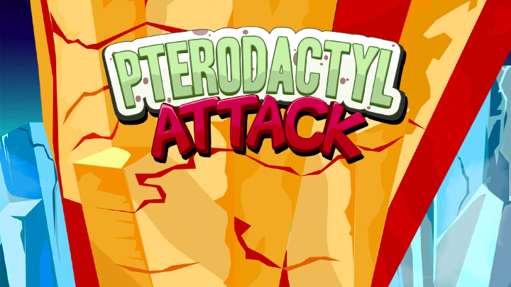
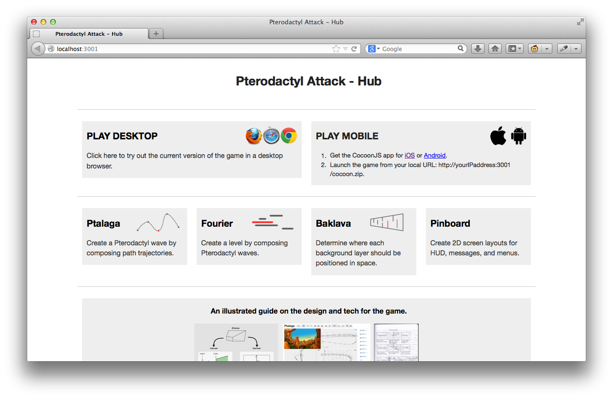
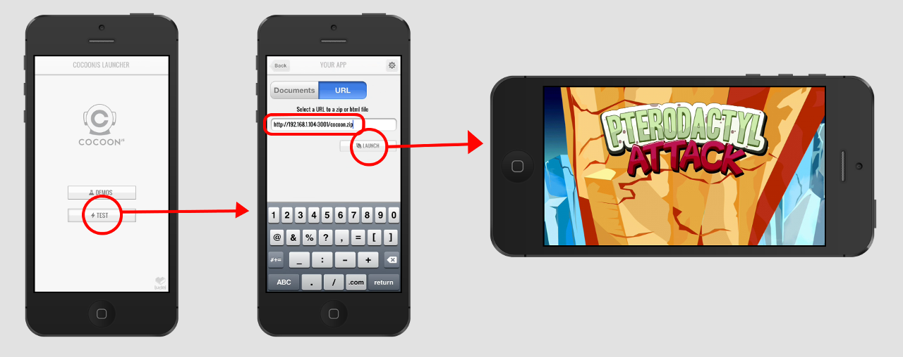
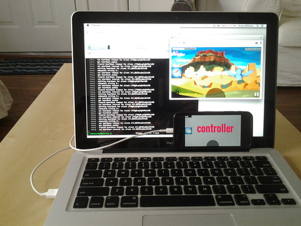

# Pterodacyl Attack



[Pterodactyl Attack](http://pteroattack.com) is an iOS game made at [Hygoon
Studio](http://hygoon.com).  It was created in Javascript/HTML5/Canvas2D from
the ground up and can be played from the web browser as well as mobile devices
via [CocoonJS](https://www.ludei.com/cocoonjs/).

This repository contains the our entire development workflow (code, assets,
tools, workspace, server, build scripts).  It also contains the entire history
of revisions from its early prototype on January 2013 to its current completed
stage on January 2014.

## The Book

[](http://pteroattack.com/#quick-look)

To understand the context of our game, code, and tools, I highly recommend
reading our comprehensive illustrated guide that covers the high- and low-level
details of our workflow: <http://pteroattack.com/#quick-look>

This provided context should make it a lot easier to dive into the code
and workspace.

## Buying the Game

If you wish to play the game on iPhone or iPad, you can buy it here:

[](https://itunes.apple.com/us/app/pterodactyl-attack/id786862892?mt=8&ign-mpt=uo%3D4)

## License

This program is free software: you can redistribute it and/or modify it under
the terms of the __GNU General Public License Version 3__ as published by the Free
Software Foundation

[](http://www.gnu.org/licenses/gpl-3.0.html)

## Setting up

To setup your workstation to start developing and running Pterodactyl Attack,
there are some "one-time steps" to follow. But there are also some "every-time
steps" that you must remember to execute in your workflow.

### One-Time Setup

This section covers all the one-time setup steps for the development workspace.
(You can safely forget them after completing them.)

#### Installing Dependencies 

Download and install the following required programs:

- Get [Git](http://git-scm.com/downloads). This is used to "clone" this repository.  This downloads our current workspace and its entire history of revisions.
- Get [NodeJS](http://nodejs.org/download/) so you can run the server for the workspace.  This "serves" the local webpage for the game and tools and facilitates
the tool operations.
- Get the latest [Python 2.7.x](http://www.python.org/download/) so you can run the build scripts.

You can get these as well, but they are optional:

- Optionally, get a [Git GUI](http://git-scm.com/downloads/guis) if you prefer GUI interfaces over command lines.
- Optionally, get [Sublime Text](http://www.sublimetext.com/) if you want a nice text editor for navigating and editing the code.

#### Retrieving the workspace

You can place the workspace anywhere you want on your computer.  Using Git from
the command prompt, you can type the following:

```
> git clone https://github.com/shaunlebron/PterodactylAttack.git
```

OR if you are using a GUI, use the URL above as the source for your clone operation.

#### Setting up server dependencies

Using a command prompt, navigate to the repository that you cloned and type the following:

```
> npm install
```

(This automatically creates a "node_modules" folder in the workspace and installs the NodeJS
modules there required by this project, listed in "package.json".)

#### Setting up your mobile device

The game will run fine on a web browser, but if you want to test it on a mobile
device, you must register for a free account on
[CocoonJS](https://www.ludei.com/cocoonjs/).  Then you can install either of these
launcher applications (free) on your mobile devices:

- [CocoonJS Launcher for Android](https://play.google.com/store/apps/details?id=com.ideateca.cocoonjslauncher)
- [CocoonJS Launcher for iOS](https://itunes.apple.com/us/app/cocoonjs-by-ludei/id519623307?mt=8)

### Every-time setup

Now, here are some things that you have to remember to do everytime you want to
mess around in this workspace.

#### Keep the server running!

The server is the important center of the entire workflow.  It must be
running whenever you want to test the game or run the tools.  To start the
server, navigate to the repository on the command line, and type the following:

```
> node server
```

This will run the server. To stop the server, hit CTRL+C or simply close the window.

#### Rebuild the game after every change!

Whenever you make changes to the game, you must remember to "build" the game so
that your changes are reflected.  To do this, you must execute this from the
command line at the repository:

```
> python build.py
```

This will update some dependent files from your current changes and build the
"cocoon.zip" file for testing on mobile devices.

## Playing the game and running the tools

The game runs on desktop web browsers or on mobile devices through the CocoonJS
launcher.  But you can only run the tools on the Desktop browser.

### Desktop

Remember to start the server!  To play the game or run the tools, open a web
browser (preferably Chrome, but Safari and Firefox wil do), and navigate to:

```
http://localhost:3001
```

This points your browser to the webpage served by the Pterodactyl Attack
server.  You will see a "hub" of links to the game and tools.



You can watch these videos to learn how to use the tools:

- [How to use Ptalaga (path tool)](http://www.youtube.com/watch?v=2Tc6txawD4U)
- [How to use Baklava (environment tool)](http://www.youtube.com/watch?v=gLQTp4_BDoM)
- [How to use Pinboard (layout tool)](http://www.youtube.com/watch?v=b3_EXQTKDc4)

### Mobile

Before testing the game on your mobile device, remember to run the build script 
and make sure the server is running.

Your mobile device has to somehow read the "cocoon.zip" file in the root
directory of the repository.  You can either a) copy the file to your device,
or b) network your phone to your computer and point CocoonJS launcher to the
URL http://yourIPaddress:3001/cocoon.zip.



### Mobile + Desktop (remote control)

The desktop web browser displays the game at superior image quality, but the
game is difficult to control with a mouse.  To make up for this, there is a way
to use a mobile device to control the game running on a desktop web browser, as
seen below:



To make this happen:

1. Run the server, of course.
2. Uncomment out the socket code at the bottom of "src/main.js"
3. Fill in the correct IP address of your computer at "src/remote/main.js" line 57.
4. Run `python build_remote.py` at the command line to create the file CocoonJS remote app, "remote.zip".
5. Run `python build.py` to update the game (as you normally would).
6. Run "remote.zip" on your CocoonJS launcher on your mobile device, either by copying the file to your device, or pointing the launcher to the URL "http://yourIPaddress:3001/remote.zip"
7. Open the game in the browser, at "http://localhost:3001/play.html"

This should allow you to shoot enemies on the desktop using your mobile device screen.

__PERFORMANCE NOTE__: To decrease input lag, I highly recommend plugging your phone into your computer via USB, and creating a paired network between them.
